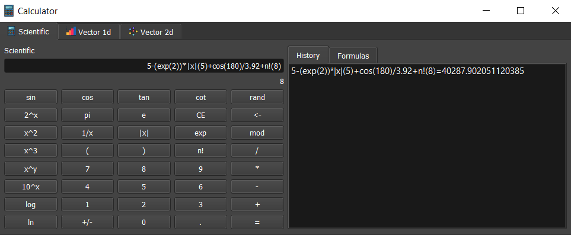
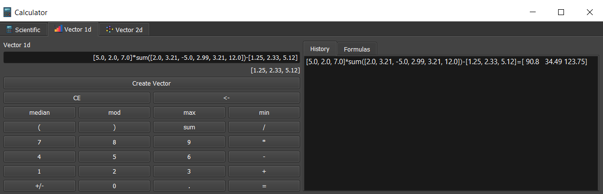

<h1> Advanced Calculator </h1>
AdvCalculator is a PyQt5 powered GUI application. <br>
AdvCalculator can calculate Scientific, 1D vector and 2D vector expressions. You can run the calculator program following the instructions below.

```shell

>> git clone https://github.com/bilginyuksel/AdvCalculator.git
>> cd AdvCalculator/
>> pip install -r requirements.txt
>> cd view/
>> python calcmain.py
```

<h3>Scientific Mode</h3>


<h3>Vec1D Mode</h3>


<h3>Vec2D Mode</h3>

